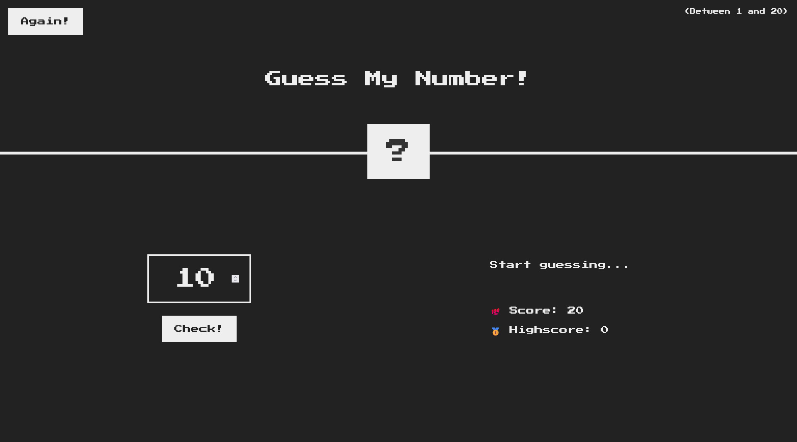

# 🎯 Guess My Number

A fun and interactive **number guessing game** built with **HTML, CSS, and vanilla JavaScript**.  
Developed as part of a Udemy JavaScript course to practice **DOM manipulation**, **event handling**, and **state management**.



---

## 🎮 Overview

**Guess My Number** challenges you to find a secret number between **1 and 20**.  
Each incorrect guess decreases your score the faster you find the right number, the higher your final score.  

This project was created as part of a JavaScript Udemy course and rebuilt from scratch by following various coding challenges.  
It’s designed to reinforce core front-end concepts like **real-time UI updates**, **user input validation**, and **conditional logic**.  
All logic is implemented in pure JavaScript, no external libraries or frameworks.

---

## 🚀 Features

- 🎲 Random number generation between 1–20  
- 💯 Score and highscore tracking  
- ⚡ Real-time feedback (too high / too low / correct)  
- 🌈 Dynamic background color change when you win  
- 🔁 “Play Again” button to instantly restart  
- 🧩 Fully responsive layout and pixel-style design  
- 🧠 100% **vanilla JS**, no frameworks, no dependencies  

---

## 🧩 Tech Stack

| Technology | Purpose |
|-------------|----------|
| **HTML5** | Structure and semantic layout |
| **CSS3** | Styling, retro look, responsive design |
| **Vanilla JavaScript (ES6)** | Core logic, DOM updates, event listeners |
| **Google Fonts – Press Start 2P** | Retro pixel-style typography |

---

## 💡 What I Learned

- Handling **user input** with `querySelector` and event listeners  
- Creating and updating **dynamic DOM content**  
- Managing state using variables like `score`, `highscore`, and `secretNumber`  
- Writing reusable functions like `displayMessage()`  
- Using **conditional operators** and concise logic structures  
- Improving the user experience through small visual details  

This project was an excellent hands-on exercise in combining JavaScript logic with real-time user interaction and UI feedback.

---

## 🕹️ How to Play

1. Open `index.html` in your browser  
2. Enter a number between **1 and 20**  
3. Click **Check!** to see if you guessed correctly  
4. You’ll get hints:
   - 📈 “Too high!”
   - 📉 “Too low!”
   - 🎉 “Correct Number!”
5. Try to guess before your score hits zero  
6. Click **Again!** to reset and play another round 🎯  

---

## ⚙️ Setup

Clone the repository:

```bash
git clone https://github.com/MirkoRimac/guess-my-number.git
cd guess-my-number
